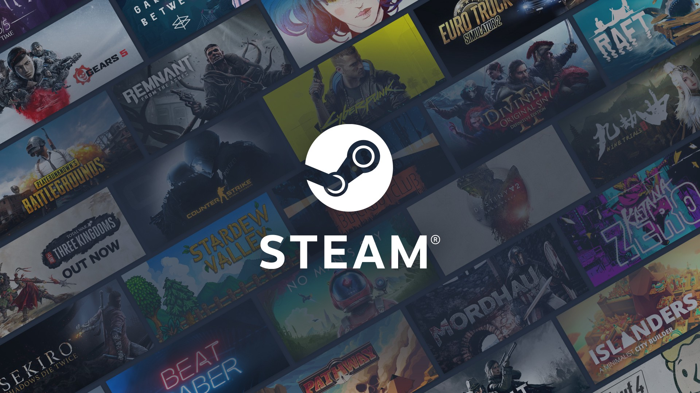

# Recommended For You  
## Steam-Based Game Recommendation Engine  
  

# Introduction  
Steam is the world's most popular PC Gaming hub, with over 6,000 games and a community of millions of gamers. With a massive collection that includes everything from AAA blockbusters to small indie titles, great discovery tools are a highly valuable asset for Steam. In this project, we developed a game recommendation engine based on [Steam user data](https://www.kaggle.com/tamber/steam-video-games). This engine recommends games to users based on how much time they spent playing previous games and their similarity to other video game players. In other words, it predicts which games a user is likely to spend the most time playing. This prediction would allow for user-specific video game advertising.   

# Approch  
* Exploratory Analysis: MDS and K-means to cluster/segment users and games into groups.  
* Heuristics to segment customers using hours played as a metric for ratings:  
    - User-based collaborative filtering.  
    - Game-based collaborative filtering.  
* Matrix Factorization to solve problems created by collaborative filtering.    

# Outcomes Display  
## 1. Collaborative Filtering  
We explored user-based and game-based collaborative filtering algorithms for the recommendation engine.  
For **user-based collaborative filtering(UB-CF)**, it is based on an assumption that similar gamers have similar tastes in games. If gamer A and gamer B have played very similar games in the past and they rated games by very similar scores,UB-CF algorithm will recommend games that A enjoys playing recently to B. 
For **game-based collaborative filtering(GB-CF)**, instead of looking for similar gamers to make recommendations, it looks for games which are similar to games that player A loves. While UB-CF algorithm focuses on the correlations among players, GB-CF algorithm calculates correlations among games to search for games a player might want to play next.  
To test the engines based on the two algorithms, we recruited 30 test users and asked them to rate a list of games they played in the past. Based on the recommendations made to the test users and their reflections, engine ultilizing UB-CF algorithm has better performance overall.  
[ubcf-rmcd]  
As you can see above, from the test run,  based on their gaming history, our engine recommended `alien swarm` to Justin and `half-life 2` to Manan which, according to the two gamers, are both very meaningful recommendations. However, the engine failed to make recommendation to me (Hao) since I don't play on Steam very much. This exposed a shortcoming of UB-CF algorithm that it requires a significant amount of games played to make recommendations, which is not friendly to new Steam users. 

However, these new users are exactly the main targets for such recommendation program in real-life business application in order to cultivate user stickiness 

